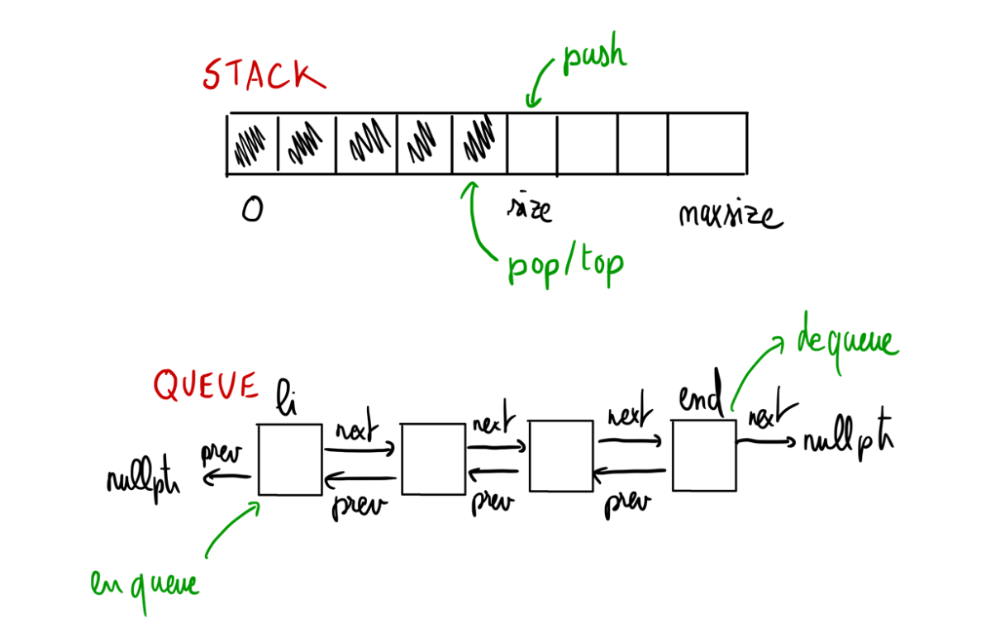

# ASD 23/24 - Laboratorio 3



In questo laboratorio viene richiesto di implementare due tipi di dato (TDD), le pile (o stack) e le code (o queue), seguendo
le seguenti indicazioni (specifiche):

- La TDD pila di interi sarà implementata usando una struttura dati che integri un array dinamico, con espansione/contrazione della dimensione dell’array quando necessario.
- La TDD coda di interi sarà implementata usando una struttura dati che integri una lista doppiamente collegata con un puntatore al inizia della lista e un puntatore alle fine della lista.

Lo scopo dei due strutture dati è di implementare le operazione di inserimento e di estrazione in tempo costante (che non
dipenda della grandezza della pila o della coda), tranne per la pila quando si fa un espansione o un contrazione della dimensione
dell’array.

# 1 Pila di interi

## 1.1 Materiale dato

Nel file asd-lab3-traccia.zip, trovate:

- Un file ASD-stack-array.h contenente le definizioni di tipo dato e le intestazioni delle funzioni
- Un file ASD-stack-array.cpp dove dovete scrivere l’implementazione delle funzioni richieste
- Un file ASD-stack-test.cpp contenente un programma principale che avvia una sequenza di test automatici
- Diversi file.txt che contengono sequenze di numeri interi e possono essere utilizzati come file di input

L’unico file da modificare è quindi ASD-stack-array.cpp.

## 1.2 Funzioni da implementare

Il file ASD-stack-array.h contiene i prototipi delle funzioni che andranno implementate da voi nel fileASD-stack-array.cpp e richiamate in ASD-stack-test.cpp. Questi prototipi costituiscono l’interfaccia delle nostre funzioni sulle pile e come potete
vedere, visionando il codice, sono racchiusi all’interno del namespacestack.
È richiesto di implementare le funzioni seguenti (solo ed esclusivamente), contenute nel fileASD-stack-array.cpp.
**NOTA:**
Gli altri file non devono essere modificati (salvo che per scopi di testing, ma poi devono essere riportati come da originale)

<h3> Prototipi di funzioni da implementare  </h3>

```cpp
// restituisce lo stack vuoto 
Stack createEmpty ();
```
```cpp
// restituisce true se lo stack e' vuoto
bool isEmpty(const Stack &);
```
```cpp
// aggiunge elem in cima (operazione safe , si puo' sempre fare)
void push(const Elem , Stack &);
```
```cpp
// toglie dallo stack l'ultimo elemento e lo restituisce 
// se lo stack e' vuoto solleva una eccezione di tipo string 
Elem pop(Stack &);
```
```cpp
// restituisce l'ultimo elemento dello stack senza toglierlo. Se lo stack e' vuoto solleva una eccezione di tipo string
Elem top(Stack &);
```
Inoltre, vi forniamo l’implementazione delle funzioni seguenti che supportano l’esecuzione dei test.


<h3> Prototipi di funzioni implementate </h3>

```cpp
// riempie lo stack da file 
Stack readFromFile(std:: string );
```
```cpp
// legge il contenuto di uno stack da standard input
Stack readFromStdin ();
```
```cpp
// stampa lo stack
void print(const Stack &);
```
```cpp
//produce una stringa contenente lo stack
std:: string tostring(const Stack &);
```

Ogni volta, che completate una funzione, vi raccomandiamo di compilare il file usando il comando:
```g++ -Wall -std=c++14 -c ASD-stack-array.cpp```
per verificare gli errori di sintassi. Se lo ritenete necessari, potete crearvi un vostro programma main per eseguire dei vostri test.

## 1.3 Funzionamento

Come lo potete vedere nel fileASD-stack-array.h, per implementare uno stack usiamo un array. In fatti, abbiamo:

```cpp
//lunghezza dei blocchi da aggiungere
//quando l'array dinamico cresce
const unsigned int BLOCKDIM = 10;
```
```cpp
// tipo base
typedef int Elem;
```
```cpp
typedef struct {
// array dove saranno messi gli elementi
Elem⁎ data;
// posizione del ultimo elemento
unsigned int size;
// lunghezza dell'array
unsigned int maxsize;
} Stack;
```
L’idea è che il campodata contiene l’indirizzo di un array di cui la lunghezza iniziale sarà BLOCKDIM, il campo max size contiene la dimensione di data e il campo size dice dove sarà inserito il prossimo elemento. Come vogliamo simulare una pila, al inizio avremo sizeuguale a 0 ed ogni volta che si aggiunge un elemento sulla pila, lo mettiamo alla posizione size dell’array e aumentiamo size; ogni volta che vogliamo prendere un elemento, prendiamo quello all’indicesize -1 e diminuiamo size.


Ovviamente, bisogna stare attenti ai casi in cuisizevale 0 o è uguale amaxsize. Infatti, quandosizeè uguale a max size e vogliamo inserire un nuovo elemento, allora è necessario prima aumentare la lunghezza dell’arraydata(copiandolo in un array più grande).

## 1.4 Tests automatici

Nel file ASD-stack-test.cpp, abbiamo programmato una sequenza di tests che si eseguono automaticamente e dove verifichi mo che le funzioni implementati si comportano bene. Per usare questo programma, potete compilarlo cosi: 
```g++ -Wall -std=c++14 ASD-stack-array.cpp ASD-stack-test.cpp -o ASD-stack-test```
e poi eseguirlo con ./ASD-stack-test.

# 2 Coda di interi

## 2.1 Materiale dato

Nel file asd-lab3-traccia.zip, trovate:

- Un file ASD-queue-list.h contenente le definizioni di tipo dato e le intestazioni delle funzioni
- Un file ASD-queue-list.cpp dove dovete scrivere l’implementazione delle funzioni richieste
- Un file ASD-queue-test.cpp contenente un programma principale che avvia una sequenza di test automatici
- Diversi file.txt che contengono sequenze di numeri interi e possono essere utilizzati come file di input

L’unico file da modificare è quindi ASD-queue-list.cpp.

## 2.2 Funzioni da implementare

Il file ASD-queue-list.h contiene i prototipi delle funzioni che andranno implementate da voi nel file ASD-queue-list.cpp e richiamate in ASD-queue-test.cpp. Questi prototipi costituiscono l’interfaccia delle nostre funzioni sulle pile e come potete vedere, visionando il codice, sono racchiusi all’interno del namespacequeue.
È richiesto di implementare le funzioni seguenti (solo ed esclusivamente), contenute nel file ASD-queue-list.cpp.
 **NOTA:**
Gli altri file non devono essere modificati (salvo che per scopi di testing, ma poi devono essere riportati come da originale)

<h3> prototipi di funzioni da implementare </h3>

```cpp
// restituisce la coda vuota 
Queue createEmpty ();
```
```cpp
// restituisce true se la queue e' vuota 
bool isEmpty(const Queue &);
```
```
// inserisce l'elemento "da una parte" della coda 
void enqueue(Elem , Queue &);
```
```
// cancella l'elemento (se esiste) "dall'altra parte 
// della coda" e lo restituisce; se la coda e' vuota solleva 
//una eccezione di tipo string 
Elem dequeue(Queue &);
```
```
// restituisce l'elemento in prima posizione (se esiste) senza cancellarlo 
//se la coda e' vuota solleva una eccezione di tipo string 
Elem first(Queue &);
```
Inoltre, vi forniamo l’implementazione delle funzioni seguenti che supportano l’esecuzione dei test.

<h3>Prototipi di funzioni implementate </h3>

```cpp
//riempie una coda da file 
Queue readFromFile(std:: string );
```

```cpp
// legge il contenuto di una coda da standard input 
Queue readFromStdin ();
```
```cpp
// stampa la coda
void print(const Queue &);
```

```cpp
// produce una string contenente la coda
std:: string tostring(const Queue &);
```

Ogni volta, che completate una funzione, vi raccomandiamo di compilare il file usando il comando:
```g++ -Wall -std=c++14 -c ASD-queue-list.cpp ```
per verificare gli errori di sintassi. Se lo ritenete necessari, potete crearvi un vostro programma main per eseguire dei vostri test.

## 2.3 Funzionamento

Come lo potete vedere nel fileASD-queue-list.h, per implementare una coda usiamo una lista doppiamente collegata. Infatti,
abbiamo:

```cpp
// tipo base
typedef int Elem;
```
```cpp
struct cell;
```
```cpp
typedef cell ⁎list;
```
```cpp
const list EMPTYLIST = nullptr;
```
```cpp
typedef struct { // lista dove saranno messi gli elementi , uguale a nullptr se e vuota
list li; // ultimo elemento della lista , uguale a nullptr se e vuota
list end;
} Queue;
```
L’idea è che il campolicontiene l’indirizzo della prima cellula della lista e il campoendcontiene l’indirizzo dell’ultima
cellula della lista. Quando la coda è vuota, questi due campi valgononullptr. Come vogliamo simulare una coda, inseriremo
sempre al inizio della lista e toglieremo gli elementi alla fine, spostando i puntatorilieend. Ovviamente, bisogna stare attenti
ai casi in cui la lista è o diventa vuota.

## 2.4 Tests automatici

Nel file ASD-queue-test.cpp, abbiamo programmato una sequenza di test che si eseguono automaticamente e dove verifichiamo che le funzioni implementati si comportano bene. Per usare questo programma, potete compilarlo cosi:
```cpp
g++ -Wall -std=c++14 ASD-queue-list.cpp ASD-queue-test.cpp -o ASD-queue-test
e poi eseguirlo con ./ASD-queue-test. ```