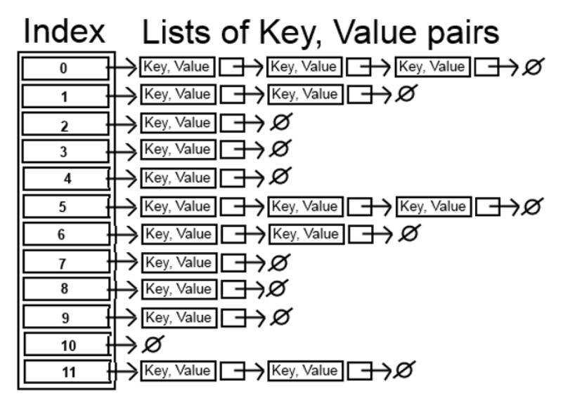
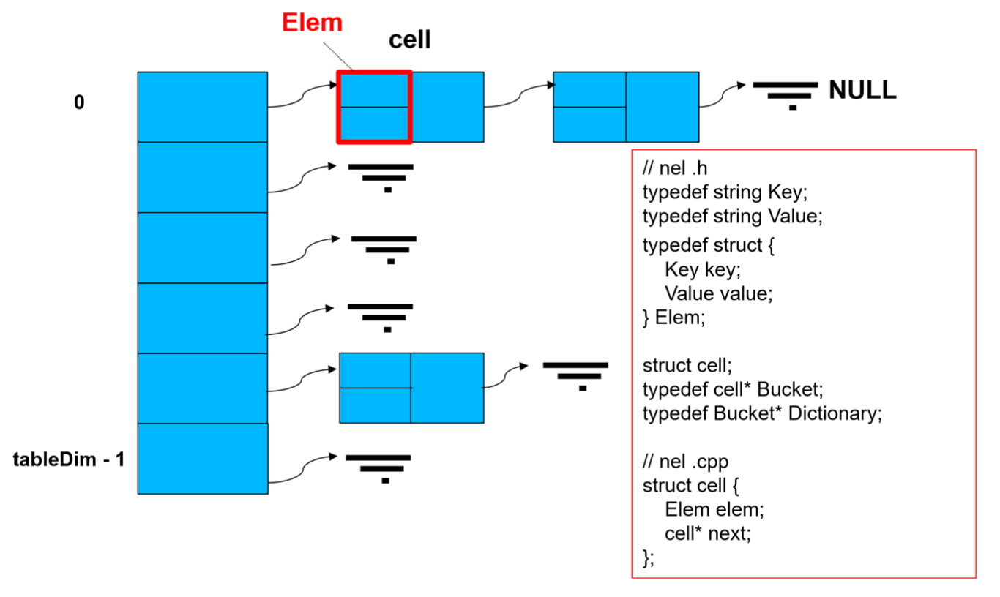
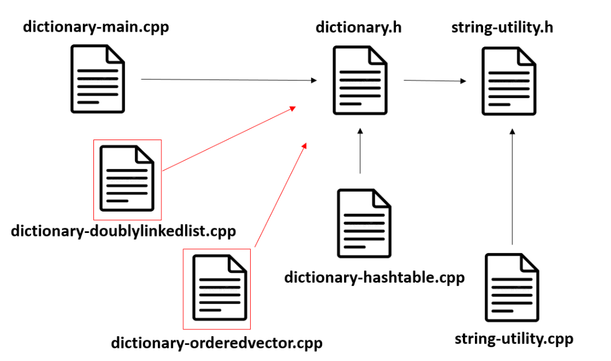
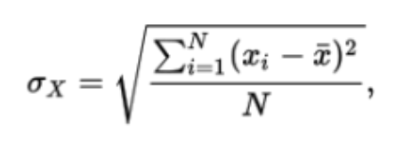
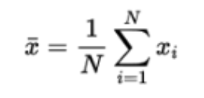

# ASD 23/24 - Laboratorio 5

Siano U l'insieme delle stringhe che rappresentano parole di senso compiuto nella lingua inglese ed E l'insieme delle stringhe che rappresentano definizioni di parole di senso compiuto della lingua inglese.

In questo laboratorio è richiesto di implementare il TDD “Dizionario di coppie (k, e), in cui ogni k appartiene a U ed
ogni e appartiene ad E” mediante la struttura dati “tabella di hash con liste di collisione” raffigurata sotto.

 

Il file dictionary-hashtable.cpp (che troverete nel file .zip presente in Aulaweb) contiene alcune funzioni già implementate, tra le quali createEmptyDict() (che vi può aiutare a capire come è fatta una variabile di tipo Dictionary) e tutte le funzioni di lettura e di stampa, inclusa la stampa di informazioni statistiche sull'organizzazione del dizionario.

## Funzioni da Implementare

In questo laboratorio è richiesto di implementare le seguenti sei funzioni:

- <b> Error insertElem(const Key k, const Value v, Dictionary &s) </b>

funzione che aggiunge una coppia (k, v) al dizionario s. Prima funzione da implementare in quanto necessaria per effettuare la lettura da file dei dati. Ricordarsi che non si può inserire una coppia (k, v) se esiste già una coppia (k,v’) nel dizionario. A tal fine aggiungere questo controllo alla funzione insertElem dopo aver completato la funzione search. La funzione insertElem ritorna OK se l’inserimento è andato a buon fine, FAIL altrimenti.

- <b> Value search(const Key k, const Dictionar &s) </b>

funzione che ritorna il Value v associato alla chiave k se k è presente nel dizionario, cioè nella lista puntata da s[h(k)], dove h è la funzione hash usata. Altrimenti ritorna un emptyValue (già definito nel .h).

- <b>Error deleteElem(const Key k, Dictionary &s)</b>

funzione che elimina la coppia (k, v) dal dizionario s se presente e ritorna OK. Se non presente ritorna FAIL.

- <b>int h1(Key s)</b>

funzione di hash che considera unicamente il valore ascii del primo carattere della chiave (se esiste) e restituisce resto della divisione di tale valore per tableDim;

- <b>int h2(Key s)</b>

funzione di hash che somma il codice ascii di ogni carattere nella chiave e restituisce il resto della divisione di tale somma per tableDim;

- <b>int h3(Key s)</b>

funzione che dovete inventare voi seguendo qualche criterio ragionevole e che motiverete nel file di comprensione dei dati sperimentali;

Nel file string-utility.cpp (sempre presente nel file .zip scaricato) sono inoltre implementate alcune funzioni per “nomalizzare” le chiavi, rendendo tutti i caratteri minuscoli ed eliminando gli spazi. Potete trarre ispirazione da queste funzioni per implementare le vostre funzioni di hash.

Notate che l'ordine in cui sono disposte le funzioni nel file dictionary-hashtable.cpp non corrisponde necessariamente all'ordine in cui le dovete implementare. In particolare, come avete già riscontrato in altre occasioni, la prima funzione da implementare è l'aggiunta di un elemento al dizionario (insertElem) senza la quale non è possibile effettuare la lettura da file dei dati.

## Dettagli su Implementazione del Dictionary come Hash Table

Un Dictionary è un array dinamico di dimensione tableDim di puntatori a cell (a cui diamo il nome "Bucket"). Quindi fate attenzione che dentro all’array troveremo dei puntatori a cell. tableDim è una costante che viene fissata in fase di inizializzazione.

 

Come già fatto in altre occasioni, la struttura di cell è definita nel file ausiliario dictionary-hashtable.cpp per incapsulare il più possibile l'informazione. Quindi per visionare la struct che definisce la cella dobbiamo aprire il file dictionary-hashtable.cpp. Di fatto una cella è costituita da un Elem che è il payload (vedere figura, in rosso) e da un puntatore alla cella successiva che può essere chiaramente anche NULL. Un Elem è costituito dalla coppia chiave - valore che costituiscono le nostre due stringhe. La chiave (key) è la parola del dizionario mentre il valore (value) è la definizione della parola stessa.

## File presenti nella Traccia

- <b>Dictionary-main.cpp</b>: il main contiene il menu che permette di eseguire le varie operazioni sul dizionario - NON MODIFICARE
-<b> Dictionary.h</b>: contiene strutture dati e prototipi delle funzioni che andranno implementate nel file dictionary-hashtable.cpp e richiamate in Dictionary-main.cpp. Header - NON MODIFICARE
- <b>Dictionary-hashtable.cpp</b> : implementazione del Dizionario mediante tabelle di hash. Implementare qui le 6 funzioni richieste
- <b>StringUtility.cpp, StringUtility.h</b>: Questi file contengono delle funzioni per “nomalizzare” le chiavi, rendendo tutti i caratteri minuscoli ed eliminando gli spazi
- <b>Folder EngEng</b>: Contiene dei file ‘dizionario’ chiave-valore

 


In figura vediamo in modo grafico la relazione che esiste tra i file principali del progetto. Le frecce rappresentano gli include. E’ importante notare che non esistono include tra i file .cpp. Quello che succede è che il file dictionary-hashtable.cpp include il file dictionary.h perchè fornisce l’implementazione dei prototipi delle funzioni presenti nel file .h. Mentre il file dictionary-main.cpp include il file dictionary.h perchè deve conoscere i prototipi di funzione forniti nel file .h per poterli richiamare, funzioni che dovete implementare voi in dictionary-hashtable.cpp). Vedete poi che nella gerarchia di include sono compresi anche i file che forniscono le funzioni di utility.

Nel file .zip che dovete scaricare troverete anche altri due files che contengono l'implementazione del dizionario basata su lista doppiamente collegata con sentinella e ordinata e l’implementazione del dizionario basata su Vector. Sono i file. marcati in rosso nella figura. Questi due sono. file sono già completi e non li dovete modificare, sono stati creati dai docenti. Potete chiaramente vedere l’implementazione fatta anche per apprezzare le differenze rispetto alla vostra implementazione basata su tabelle di hash. Tuttavia questi files sono stati inseriti nello zip solo per permettervi di eseguire la parte sperimentale. Quindi il vostro obbiettivo è quello di eseguire questi file per raccogliere dei dati e confrontarli con i dati raccolti con la vostra implementazione.

## Compilazione

I comandi che dovrete utilizzare per compilare il programma sono riportati all'inizio del file dictionary-main.cpp e li potete vedere anche alla fine di questa slide.

Dovete prestare attenzione ai flag di compilazione indicati, specialmente quelli che iniziano con "-D", i quali servono a selezionare le tre diverse implementazioni del TDD da mettere a confronto nella parte sperimentale, ossia: quella basata su vettore ordinato, quella basata su lista ordinata, e quella basata su tabella hash.

``` COME COMPILARE IL PROGRAMMA

Per usare l'implementazione del dizionario basata su vettore ordinato:

g++ -std=c++11 -Wall -DUSE_ORDERED_VECTOR dictionary-orderedvector.cpp string-utility.cpp dictionary-main.cpp

 Per usare l'implementazione del dizionario basata su lista doppiamente collegata con sentinella e ordinata:

 g++ -std=c++11 -Wall -DUSE_ORDERED_LIST dictionary-doublylinkedlist.cpp string-utility.cpp dictionary-main.cpp


Per usare l'implementazione del dizionario basata su tabella hash:

g++ -std=c++11 -Wall -DUSE_HASH_TABLE dictionary-hashtable.cpp string-utility.cpp dictionary-main.cpp
```

## Sperimentazione

I file organizzazione-hash-table.xls e tempi-di-esecuzione-operazioni-dict.xls che trovate nel file .zip contengono delle tabelle da completare nelle quali dovete inserire i risultati dei vostri esperimenti. Tra i vari esperimenti proposti ci sono anche quelli che prevedono l'uso di strutture dati diverse dalla tabella di hash per la realizzazione del TDD Dizionario. Tali strutture dati sono già state implementate dai docenti (troverete i vari .cpp nello zip-file). Voi dovete solo usare queste implementazioni e riportare i dati sperimentali sul file tempi-di-esecuzione-operazioni-dict.xls.

## Parte 1 – Analisi delle funzione hash h1, h2 e h

Nel file organizzazione-hash-table.xls si fa riferimento esclusivamente alla vostra implementazione con hash table e si
devono riportare nel file excel diversi dati raccolti con diverse esecuzioni fatte con
- file di input diversi,
- cambiando la funzione di hash implementata e
- cambiando la dimensione della tabella di hash.

In particolare, per ogni configurazione richiesta voi dovete raccogliere per ogni esecuzione:
- il numero totale di elementi memorizzati,
- il numero di bucket (che corrisponde alla dimensione della vostra tabella di hash),
- il fattore di carico, che rappresenta il numero atteso di elementi per bucket se la funzione di hash riuscisse a
distribuire perfettamente gli elementi nei vari bucket,
- e la deviazione standard

Questi valori sono calcolati e stampati dalla funzione print che trovate già implementata dai docenti. Potete eseguirla scegliendo l’apposita voce nel menu.

Lo deviazione standard (o scarto quadratico medio) è uno dei modi per esprimere la dispersione dei dati intorno ad un indice che nel nostro caso è la media aritmetica. In pratica, maggiore è lo scarto quadratico medio, tanto più “diversi dal valor medio” sono i dati. In statistica, la deviazione standard (o scarto quadratico medio) rilevato su un insieme di N dati indicati con x1,x2, ..., xN si definisce come:

 


Dove:

 

è la media aritmetica dei dati x1, x2, ..., xN.

x<sub>i</sub> nel nostro caso è il numero di coppie chiave valori salvate nella lista associata al bucket i-esimo. Nei nostri esperimenti lo scarto quadratico medio serve a misurare quanto gli elementi (chiave-valore) si sono posizionati in modo uniforme nei vari bucket. Se lo scarto quadratico medio è basso, allora i dati sono “ben distribuiti”. Se è alto, vuole dire che ci sono fenomeni di agglomerazione, con bucket sovraffollati ed altri vuoti. In questo caso, significa che la funzione di hash adottata non è “molto buona” perché non distribuisce abbastanza uniformemente gli elementi nei bucket.


## Parte 2 – Confronto tra implementazioni del TDD Dizionario

Il file excel tempi-di-esecuzione-operazioni-dict.xls va invece riempito usando anche i file .cpp che implementano strutture dati diverse dalla tabella di hash per la realizzazione del TDD Dizionario. Come già accennato le strutture dati alternative – vector ordinato e liste linkate - sono già state implementate dai docenti (troverete i vari .cpp nello zip-file). Voi dovete solo usare queste implementazioni, cioè eseguire il codice inserendo i valori richiesti e riportare i dati sperimentali nel file. In particolare, qui siamo interessati ai tempi di esecuzione misurati in microsecondi e che vengono stampati a video per ogni opzione del menu richiamata. I fattori che vengono considerati in questo sperimentazione
sono:

- la struttura dati usata,
- se si usa la tabella di hash:
    - la dimensione della tabella e l
    - a specifica funzione di hash usata,
- il file di input che contiene un dizionario, i dati di input passati alle varie operazioni.

## Comprensione dati sperimentali ottenuti

Nel file comprendiamoGliEsperimenti.doc sono riportate diverse domande che vi guidano nella comprensione del lavoro che avete svolto e dei risultati che avete ottenuto. E' molto importante che sappiate rispondere: solo se sapete rispondere avete davvero capito cosa avete fatto durante questo laboratorio.