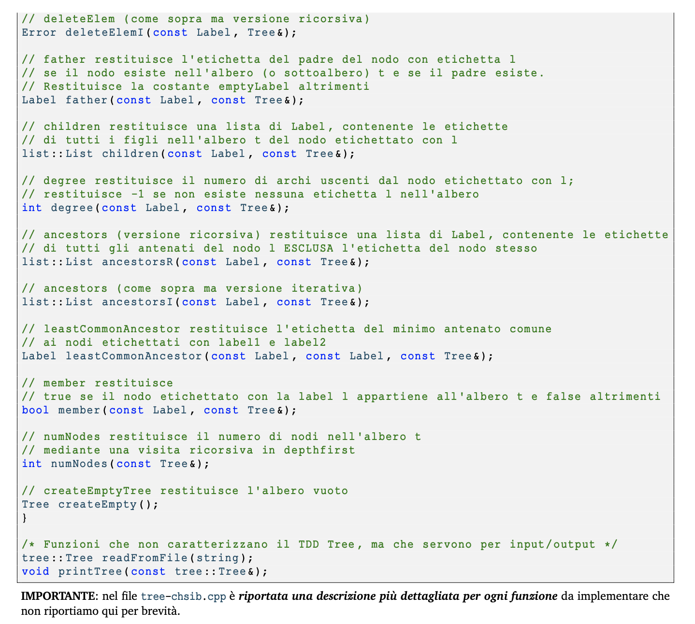

# ASD 23/24 - Laboratorio 7

# 1 Obiettivo del laboratorio

In questo laboratorio viene richiesto di **_completare il TDD Albero generico_** rappresentato con struttura dati primo figlio -
prossimo fratello (vedere figura sotto ripresa dalle slide di teoria):

# 2 Funzioni da implementare

Dovrete quindi progettare e implementare il codice delle funzioni offerte dall’interfaccia del TDD e definite, in modo incompleto,
nel filetree-chsib.cppche troverete, assieme ad altri file, all’interno del file .zip scaricabile da Aulaweb nella sezione relativa
al laboratorio 7. Più in dettaglio le funzioni da implementare sono le seguenti:

# 3 Note su implementazione

Il nodo di un albero è caratterizzato dall’etichetta, il puntatore al primo figlio e il puntatore al prossimo fratello
NON manteniamo il puntatore al padre, anche se sarebbe comodo per alcune funzioni (ma del tutto inutile per altre)

- Si noti che per due delle funzioni,deleteElemeancestors, si richiede esplicitamente un’implementazione iterativa e
    un’implementazione ricorsiva.
- Si noti che le funzioni ancestors (antenati) restituiscono la lista degli antenati di un nodo. Per realizzare queste funzioni avrete bisogno del TDD lista e quindi di due file.he.cppper implementare le liste. Nel codice da completare troverete una delle implementazioni viste durante il corso (list-array.helist-array.cpp). Usate quella e quindi non usate i Vectordel C++. Le liste servono solo per questo scopo e NON per implementare i fratelli nell’albero.
- la funzioneleastCommonAncestor, chiamata su due nodi di cui uno è la radice cosa restituisce? Nulla, perché la radice non ha ancestors e non possono esserci quindi ancestors in comune.

# 4 Suggerimenti

- Le prime due funzioni da implementare sono laaddElem, che si può testare dal main selezionando l’opzione “b”, e la printTree
- addElem viene richiamata dalla funzionereadFromStream(istream& str)ed è quindi necessaria per leggere dati da file
- Si consiglia di implementare poi le funzioni più facili (member,father,degree,numNode) e di affrontare solo all’ultimo la funzione deleteElem, nelle sue due varianti, e le funzioni ancestors, nelle sue due varianti, eleastCommonAncestor.

# 5 Formato file di Input

Il formato dei file che contengono la rappresentazione degli alberi è il seguente:

ovvero la prima riga del file deve contenere l’etichetta della radice e le righe seguenti devono contenere come prima etichetta
quella di un nodo – che deve già essere stato elencato prima – seguita dalle etichette dei suoi figli.
Esempio (“liberamente” tratto dalla classificazione dei mammiferi di Carlo Linneo):

# 6 Formato di Stampa

La funzione di stampa deve stampare l’albero in maniera strutturata usando l’indentazione per rendere esplicito il livello di un
nodo nell’albero. Ecco come deve essere stampato l’albero preso come esempio sopra:

Se non riuscite a implementare la stampa strutturata così come indicato dovete comunque stampare le informazioni sull’albero
in modo che sia chiara la struttura gerarchica, ad esempio riproponendo lo stesso formato del file di input, in cui è chiaro “chi

è il padre di chi”. Una stampa che elenchi i nodi dell’albero perdendo l’informazione della struttura gerarchica è, in questo
contesto, non corretta.

# 7 Tests manuali

Il filemain.cppcontiene ilmaindi un programma per aiutarvi a svolgere dei tests, in modo simile a quanto fatto nei precedenti
laboratori.
Per potere usare questo programma con la vostra nuova implementazione, potete compilarlo così:
g++ -std=c++11 -Wall tree-main.cpp string-utility.cpp tree-chsib.cpp list-array.cpp -o tree-main e poi eseguirlo con./tree-main.

Nella traccia trovate anche il file homo.txt che riporta il file di input per la classificazione di Carlo Linneo vista sopra.
Per svolgere dei test preliminari potete creare delle versioni semplificate di quel file oppure crearne altri ad-hoc a vostro piacimento.