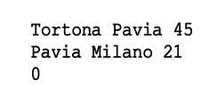

# ASD 23/24 - Laboratorio 8

in questo laboratorio, si richiede di implementare il tipo di dato _Grafo non orientato con vertici etichettati e archi pesati_. L’imple-
mentazione deve sfruttare l’approccio a **liste di adiacenza**.

# 1 Motivazione

Si consideri un navigatore satellitare, usato da un commesso viaggiatore per pianificare viaggi tra le città in cui opera i propri
commerci. Tra le tante funzioni che il navigatore deve offrire all’utente c’è anche quella di ricercare e suggerire un percorso
che, da una qualunque città di partenza, conduca ad un’altra città di arrivo. Normalmente il percorso da cercare sarebbe quello
di lunghezza minima, ma per semplicità ci limitiamo ad un percorso qualsiasi purchè sia _aciclico_ , ossia tale per cui una stessa
località venga visitata al più una volta.
Il navigatore deve poter caricare, da file o da standard input, le mappe delle regioni in cui l’utente si muoverà. A titolo di
esempio si consideri la mappa rappresentata sotto:

Tale mappa può essere rappresentata in formato testo come una lista che elenca i segmenti stradali fornendo per ciascuno le
due città estreme e la lunghezza in km. Per l’esempio in figura abbiamo:

Si noti lo “0” in fondo, utilizzato per terminare la sequenza di lettura.

Scopo di questo laboratorio è implementare le strutture dati e gli algoritmi necessari al navigatore satellitare per risolvere ade-
guatamente il problema descritto sopra. L’idea di fondo è che una mappa stradale si può rappresentare come grafo, supponendo
che le città siano i vertici e le strade siano gli archi. I vertici risultano etichettati con i nomi delle città. Gli archi, per sempli-
cità, sono non orientati (in pratica si suppone che le strade non abbiano sensi unici). Ciascun arco riceve un peso uguale alla
lunghezza in chilometri della relativa tratta stradale.

# 2 Materiale dato

Nel fileasd-lab8-traccia.zip, trovate:

- Un file graph.h contenente le intestazioni delle funzione da implementare
- Un file graph.cpp dove dovete scrivere l’implementazione delle funzioni richieste e anche definire il tipo della struttura
- Un file graph-main.cpp contenente un programma principale per testare le funzione via menù
- Un file graph-test.cpp contenente un programma principale che avvia una sequenza di test automatici
- Due file mappa.txt e mappetta.txt con la descrizione di grafi, il primo essendo più piccolo per svolgere test più semplici.
- I file list-array.h e list-array.cpp contenendo una implementazione delle liste. Questa implementazione potrà essere usata quando si chiedono liste di vertici (per esempio le funzione adjacentListefindPath), ma non deve essere usata per programmare le liste di adiacenza nella struttura.

# 3 Funzioni da implementare

I prototipi delle funzioni da implementare sono forniti nel filegraph.hcome descritto qui sotto e dovrete realizzare l’implemen-
tazione nel filegraph.cpp. Notate che la strutturastruct vertexNodenon è data e deve essere scritta da voi sempre in questo
ultimo file. **Importante:** È utile mettere un campobool isVisitedche potrà essere usato per la ricerca di cammino.

# 4 Tests manuali

Il filegraph-main.cppcontiene ilmaindi un programma per aiutarvi a svolgere dei tests.
Per potere usare questo programma con la vostra nuova implementazione, potete compilarlo così: g++ -std=c++11 -Wall list-array.cpp graph.cpp graph-main.cpp -o graph-main e poi eseguirlo con./graph-main.

Per fare le verifiche iniziali, è fornito un esempio di mappa più piccola nel filemappetta.txt.

# 5 Tests automatici

Nel filegraph-test.cpp, abbiamo programmato una sequenza di tests che si eseguono automaticamente grazie i quali verifIchiamo che le funzioni implementate si comportino bene. Per usare questo programma invece, potete compilare così: g++ -std=c++11 -Wall list-array.cpp graph.cpp graph-test.cpp -o graph-test e poi eseguirlo con./graph-test.