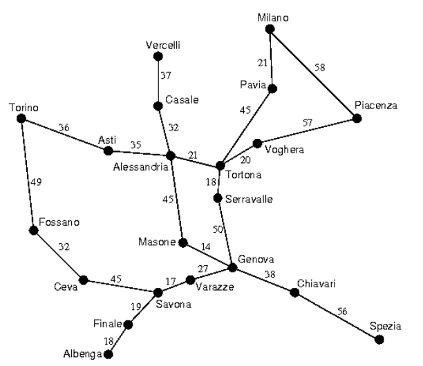
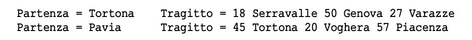
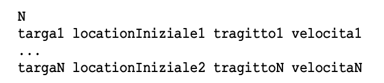
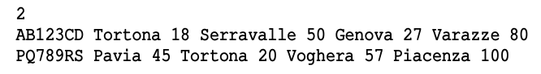
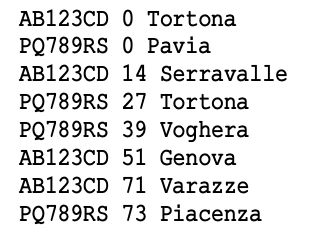
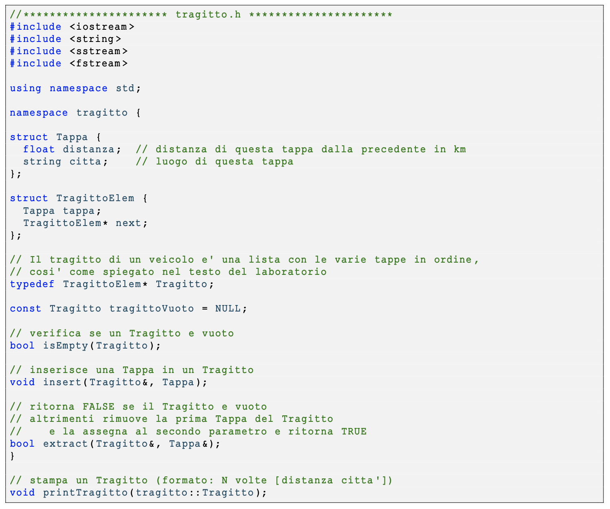
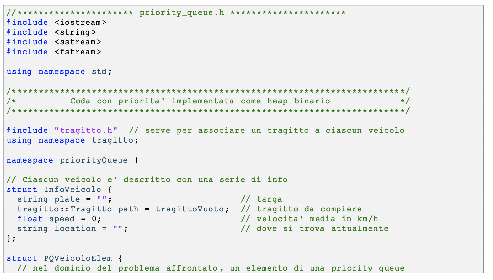
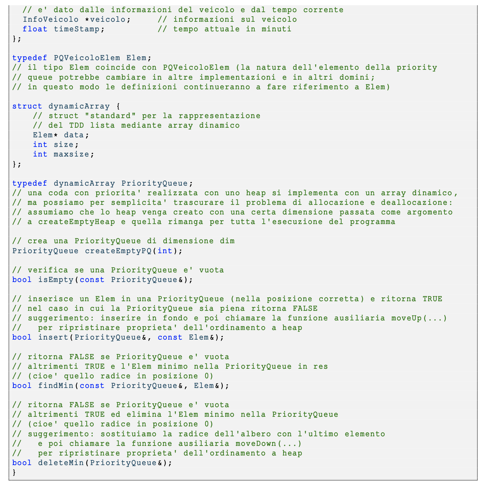

# ASD 23/24 - Laboratorio 9

# 1 Introduzione

Scopo di questa esercitazione è scrivere un **_programma che simuli, in maniera semplificata, il movimento di N automezzi
lungo una rete stradale segnalando quando un automezzo transita attraverso una città._**

## 1.1 Input

Abbiamo in input **_un insieme di tragitti di veicoli relativi ad una mappa stradale_** (come modellare una mappa e come
calcolare un tragitto in essa è stato oggetto del precedente laboratorio sui grafi).

Questo laboratorio ne rappresenta un’evoluzione e potrebbe es-
sere collegato al precedente chiedendo anche di calcolare i tra-
gitti a partire dalla mappa, ma per semplicità assumiamo che i
tragitti siano già stati calcolati e partiamo da essi.
**_Ciascun veicolo è identificato da una targa e ha una velocità
media espressa in km/h_**. Il veicolo viaggia da una città di
partenza ad una città di destinazione, attraversando una serie
di città intermedie.

## 1.2 Definizione di Tragitto

Il tragitto del veicolo è dato dalla sequenza _C_ 1 , _C_ 2 ,... , _Ck_ di
città attraversate, e dalla lunghezza _di_ di ogni tratta stradale
compresa fra due città consecutive _Ci_ , _Ci_ + 1.
Quindi, possiamo rappresentare un tragitto con una sequenza
alternata di città e di distanze in km:

d1 C1 d2 C2 ...dkCk 

dove,per i=1 ... k−1 , di è la lunghezza della tratta stradale da Ci a Ci+1.

Per esempio, relativamente alla mappa stradale mostrata sopra, sono tragitti:

## 1.3 Simulazione

Ciascun tragitto, da solo, mostra le tappe di un veicolo ma non dice nulla sullo svolgimento temporale dei suoi movimenti.
Tuttavia, conoscendo la velocità media del veicolo è possibile calcolare in quali istanti di tempo il veicolo raggiunge le varie città
previste dal suo tragitto.
Per esempio, consideriamo un veicolo che percorre il primo tragitto (da Tortona a Varazze) alla velocità media di 80 km/h (pari
a 1.33 km/min). Tale veicolo si troverà a Tortona all’istante t=0, a Serravalle all’istante t=14, a Genova a t=51, e infine a
Varazze a t=71 (tempi in minuti, arrotondati). Naturalmente si può estendere a N veicoli.

# 2 Obiettivo

Si realizzi un programma in C++ che **_simuli il movimento di N veicoli su strada_** , seguendo l’approccio indicato (vedi dopo).

## 2.1 Input del programma

I dati sono acquisiti in input (da file) nel formato:

Per esempio (due veicoli che percorrono i due tragitti esemplificati sopra):

Dunque, per ogni riga di input, la stringa iniziale rappresenta la targa; poi la località di partenza, il tragitto e l’ultimo numero
in fondo rappresenta la velocità espressa in km/h.

## 2.2 Output del programma

L’output della simulazione deve mostrare le varie tappe _nell’ordine temporale con cui esse vengono raggiunte_ dai vari mezzi. Nel
nostro esempio, sarà:

Le informazioni sul movimento, qui rappresentate in modo testuale, potrebbero essere inviate a una apposita interfaccia grafica
per la visualizzazione effettiva della flotta di veicoli sulla mappa stradale. Questa visualizzazione potrebbe essere di grande
interesse per corrieri quali DHL, FedEx, etc, ma esula dagli scopi delle nostre esercitazioni.

# 3 Implementazione: Coda con Priorità realizzata come Heap Binario

Uno dei modi più semplici per realizzare la simulazione consiste nell’utilizzare una **coda con priorità, realizzata come heap
binario** , in cui la radice è etichettata con il valore minimo (NB: nelle slide di teoria la maggior parte degli esempi sono invece
con radice etichettata da valore massimo), e seguire l’approccio seguente (che trovate già implementato nel main):

- Si acquisisce il numero N di veicoli
- Per ciascun veicolo vengono acquisite targa, la citta di partenza, il tragitto e velocità media in km/h
- Si prende la prima tappa da ciascuno degli N tragitti, che deve coincidere con la città di partenza; la si marca con l’indicazione temporale (timestamp t=0, e si inserisce nello heap; abbiamo così N elementi nello heap, tutti con timestamp t=0.

- Finché lo heap non risulta vuoto, si itera nel modo seguente:
    **-** si estrae dallo heap l’elemento E con timestamp minimo (cioè quello in posizione radice) e lo si elimina dallo heap,
    **-** si deduce il veicolo V al quale tale elemento fa riferimento,
    **-** si visualizza in output la targa del veicolo insieme al timestamp e alla tappa raggiunta (vedi esempio sopra),
    **-** si calcola la successiva tappa di V (se tale tappa esiste) e il tempo T che occorre per raggiungerla,
    **-** si somma T al timestamp di E creando così un nuovo elemento che va inserito nello heap.
- Quando lo heap è vuoto, tutti i veicoli hanno raggiunto le loro destinazioni e la simulazione è terminata. Si noti che, con questo approccio, la dimensione massima dello heap non è mai superiore a N (perché abbiamo un elemento per ogni veicolo).

Lo heap binario **deve essere realizzato mediante un array**. Nei vari elementi dell’array possono essere inserite tutte le
informazioni necessarie, tra cui ovviamente il timestamp che ha il ruolo di chiave.
Si ricorda che rappresentare un albero binario quasi completo con un array è molto semplice: i figli dell’elemento di posto
_i_ si trovano infatti nelle posizioni 2 _i_ e 2 _i_ +1 se trascuriamo la posizione 0, mentre il padre (se esiste) si trova in posizione
⌊( _i_ − 2 ) _/_ 2 ⌋+1 se trascuriamo la posizione 0. Se consideriamo anche la posizione 0, si ha che i figli dell’elemento di posto _i_ si
trovano nelle posizioni 2 _i_ +1 e 2 _i_ +2, mentre il padre (se esiste) si trova in posizione⌊( _i_ − 1 ) _/_ 2 ⌋.
Non è dunque necessario usare puntatori o indici che riferiscano ai figli o al padre. Oltre a non essere necessario, è vietato, così
come l’uso dei vector.

# 4 Funzioni da implementare

La simulazione è già implementata nel main, voi dovrete quindi progettare e implementare il codice delle funzioni nei fi-
letragitto.cpp(4 funzioni) epriority_queue.cpp(5 funzioni) che troverete, assieme ad altri file, all’interno del file .zip
scaricabile da Aulaweb nella sezione relativa al laboratorio 9. Più in dettaglio le funzioni da implementare sono le seguenti:

E’ possibile chiaramente inserire altre funzioni ausiliarie utili per l’implementazione.

# 5 Tests manuali

Il filemain.cppcontiene ilmaindi un programma per aiutarvi a svolgere dei tests, in modo simile a quanto fatto nei precedenti
laboratori.
Per potere usare questo programma con la vostra nuova implementazione, potete compilarlo così:
g++ -std=c++11 -Wall ⁎.cpp -o main
e poi eseguirlo con./main.

Nella traccia trovate anche 10 file di input che riportano le informazioni per eseguire 10 simulazioni nel formato descritto sopra.
Vi consigliamo di crearvi anche dei file con tragitti e velocità semplificati in modo da verificare il funzionamento della vostra
implementazione in modo semplice.
Inoltre, per alcuni di questi file vi riportiamo anche il rispettivo file di output contenente il risultato (atteso) della simulazione
stampato dal programma.